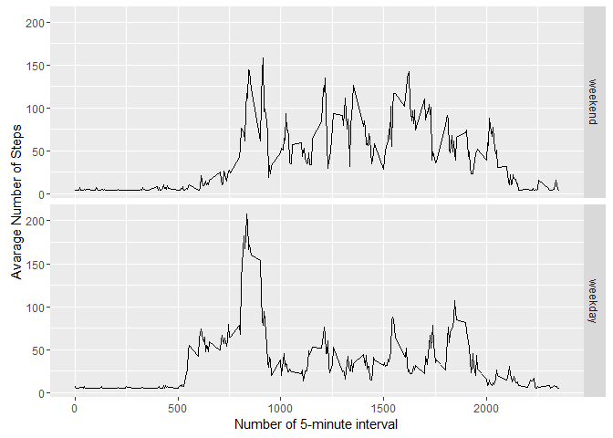

# Reproducible Research: Peer Assessment 1
## Load required library

```r
library(ggplot2)
library(Hmisc)
```


## Loading and preprocessing the data

```r
inputD = read.csv('activity.csv') 
```


## What is mean total number of steps taken per day?

```r
output_step = tapply(inputD$steps, inputD$date, sum, na.rm=TRUE)
qplot(output_step, geom="histogram",xlab='Total steps per day', ylab='Frequency', binwidth=400)
```

<!-- -->

```r
output_step_mean = mean(output_step)
output_step_median = median(output_step)
```
Mean of the total number of steps taken per day is 9354.2295082  
Median of the total number of steps taken per day is  10395


## What is the average daily activity pattern?

```r
output_avgStep = aggregate(x=list(meanSteps=inputD$steps),
  by=list(interval=inputD$interval), FUN=mean, na.rm=TRUE)

ggplot(data=output_avgStep, aes(x=interval, y=meanSteps)) +
    geom_line() +
    xlab("Number of 5-minute Intervals") +
    ylab("Average Steps Taken") 
```

<!-- -->

```r
output_int_max = output_avgStep[which.max(output_avgStep$meanSteps),1]
```
The 835th 5-minute interval, on average across all the days in the dataset, contains the maximum number of steps.

## Imputing missing values

```r
output_nNA = sum(is.na(inputD$steps))
```
The total number of rows of NA is 2304.


```r
inputD_fill = inputD
inputD_fill$steps = impute(inputD$steps, fun=mean)
```

```r
output_step_fill = tapply(inputD_fill$steps, inputD_fill$date, sum, na.rm=TRUE)
qplot(output_step_fill, geom="histogram",xlab='Total steps per day', ylab='Frequency', binwidth=400)
```

<!-- -->

```r
output_step_fill_mean = mean(output_step_fill)
output_step_fill_median = median(output_step_fill)
```
For the imputed data set:  
- Mean of the total number of steps taken per day is 1.0766189\times 10^{4}  
- Median of the total number of steps taken per day is  1.0766189\times 10^{4}  

Impact of imputing missing values makes the whole data set more towards Gaussian Distribution.

## Are there differences in activity patterns between weekdays and weekends?

```r
inputD_fill[,'week'] = weekdays(as.Date(inputD_fill$date,'%Y-%m-%d'))
inputD_fill[,'week'] <- factor((inputD_fill$week %in% c('Saturday','Sunday')), levels=c(TRUE, FALSE), labels=c('weekend', 'weekday')) 
```

```r
ouput_fill_avgStep <- aggregate(steps ~ interval + week, data=inputD_fill, mean)
ggplot(ouput_fill_avgStep, aes(interval, steps)) + 
    geom_line() + 
    facet_grid(week ~ .) +
    xlab("Number of 5-minute interval") + 
    ylab("Avarage Number of Steps")
```

<!-- -->


